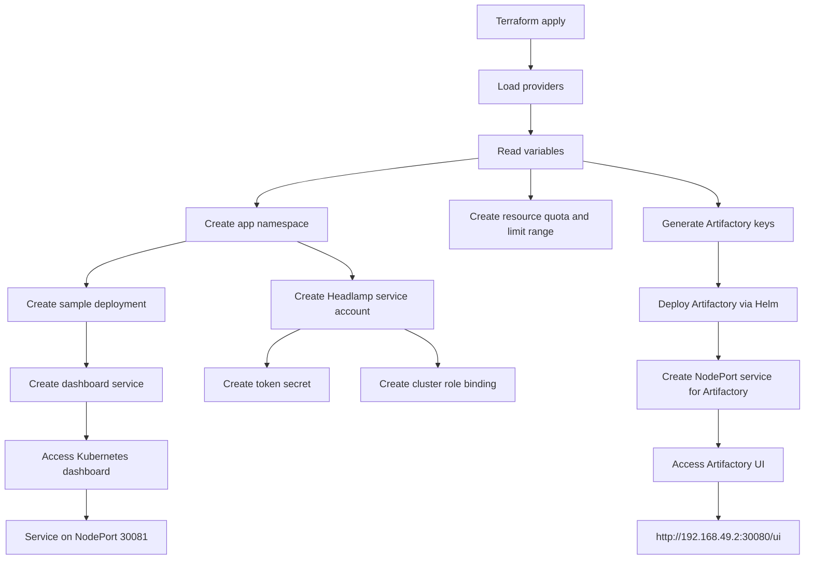

# Deploy to Kubernetes

This document explains how to provision a Kubernetes cluster and deploy a JFrog Artifactory instance locally using Terraform. It is intended as a practical guide for setting up a basic DevOps environment on a local machine.

## Overview

The workflow includes:

1. Creating the Kubernetes cluster with Terraform.
2. Verifying the cluster state.
3. Installing and configuring JFrog Artifactory.
4. Creating a Maven repository in Artifactory.
5. Configuring Maven authentication and deployment settings.

---

## Terraform module documentation

The Terraform configuration in [main.tf](main.tf) defines a local infrastructure module that provisions a Kubernetes namespace, deploys JFrog Artifactory via Helm, and exposes a lightweight Kubernetes dashboard for monitoring.

### Providers

The module configures the following Terraform providers:

```hcl
terraform {
  required_providers {
    artifactory = {
      source  = "jfrog/artifactory"
      version = "12.11.14"
    }
    kubernetes = {
      source = "hashicorp/kubernetes"
    }
    random = {
      source = "hashicorp/random"
    }
    helm = {
      source = "hashicorp/helm"
    }
  }
}
```

These providers enable Terraform to:

- manage the Kubernetes cluster,
- deploy Helm charts,
- create random secrets for Artifactory keys,
- integrate with the JFrog Artifactory provider if needed.

### Kubernetes connection

The module uses the local Minikube kubeconfig:

```hcl
provider "kubernetes" {
  config_path    = "~/.kube/config"
  config_context = "minikube"
}

provider "helm" {
  kubernetes = {
    config_path    = "~/.kube/config"
    config_context = "minikube"
  }
}
```

This ensures that all Kubernetes and Helm resources are created in the active Minikube context.

### Variables

The module exposes a set of configurable parameters for naming, resource sizing, environment metadata, and namespace configuration. Examples include:

- `namespace` — default: `k8s-ns-by-tf`
- `deployment_name` — default: `terraform-example`
- `app_label` — default: `MyExampleApp`
- `replica_count` — default: `1`
- `artifactory_namespace` — default: `artifactory-oss`
- `resource_requests_cpu` and `resource_requests_memory`
- `resource_limits_cpu` and `resource_limits_memory`
- `environment` — default: `dev`
- `owner` — default: `chefgs`

These values make the module reusable across different environments without changing the infrastructure logic.

### Core resources created

#### Namespace resources

The module creates a namespace for the sample application and a separate namespace for Artifactory:

```hcl
resource "kubernetes_namespace_v1" "example" {
  metadata {
    name = var.namespace
  }
}

resource "kubernetes_namespace_v1" "artifactory" {
  metadata {
    name = var.artifactory_namespace
  }
}
```

This separates the application workload from the Artifactory platform workload.

#### Resource quota and limits

The module adds a resource quota and limit range to the application namespace to control CPU and memory usage:

```hcl
resource "kubernetes_resource_quota_v1" "example" {
  spec {
    hard = {
      "pods"            = 10
      "requests.cpu"    = "2"
      "requests.memory" = "2Gi"
      "limits.cpu"      = "4"
      "limits.memory"   = "4Gi"
    }
  }
}
```

This helps enforce a predictable resource profile for workloads deployed to the cluster.

#### Artifactory secret keys

Random master and join keys are generated and stored in a Kubernetes secret:

```hcl
resource "random_id" "artifactory_master_key" {
  byte_length = 32
}

resource "random_id" "artifactory_join_key" {
  byte_length = 32
}
```

The generated values are then used by the Helm release for Artifactory configuration.

#### Artifactory Helm deployment

The main cluster service is JFrog Artifactory, which is installed using a Helm chart from the JFrog repository:

```hcl
resource "helm_release" "artifactory" {
  name             = "artifactory-oss"
  repository       = "https://charts.jfrog.io"
  chart            = "artifactory-oss"
  namespace        = var.artifactory_namespace
  create_namespace = false
}
```

The release configures the chart with production-like persistence and exposes it via a NodePort service.

#### Service exposure

The module creates a NodePort service to expose the Artifactory UI and backend ports:

```hcl
resource "kubernetes_service_v1" "artifactory_nodeport" {
  spec {
    port {
      port        = 8082
      target_port = 8082
      node_port   = 30080
    }

    port {
      port        = 8081
      target_port = 8081
      node_port   = 30082
    }

    type = "NodePort"
  }
}
```

This allows access to the Artifactory UI via:

```text
http://192.168.49.2:30080/ui
```

#### Dashboard deployment

The module also deploys a Headlamp instance to provide a Kubernetes dashboard and cluster visibility:

```hcl
resource "kubernetes_deployment_v1" "example" {
  metadata {
    name      = var.deployment_name
    namespace = kubernetes_namespace_v1.example.metadata[0].name
  }
}
```

It creates:

- a service account,
- a token secret for authentication,
- a cluster role binding with cluster-admin permissions,
- a Kubernetes service for dashboard exposure,
- resource requests and limits for the container.

### Outputs

The module exposes useful values such as:

- namespace name and UID,
- deployment name and replica count,
- service name and cluster IP,
- Artifactory UI NodePort,
- Kubernetes connection info,
- Headlamp token.

These outputs are useful when validating that the created resources are correct and accessible after `terraform apply`.

### How the module works



This diagram summarizes the dependency flow: Terraform reads the configuration, creates the namespaces and policies, generates Artifactory secrets, installs the Helm chart, and exposes both the Artifactory UI and the dashboard through Kubernetes services.

---

## 1. Prepare the local environment

Run the following Terraform commands from the project directory:

```bash
terraform init
terraform plan
terraform apply
```

These commands will:

- install the required providers,
- validate the resources to be created,
- provision the cluster resources in the local environment.

---

## 2. Verify the cluster

Use these commands to confirm that the cluster is ready:

```bash
kubectl cluster-info
kubectl get nodes -o wide
```

To verify that all resources were created in the `artifactory-oss` namespace:

```bash
kubectl get -n artifactory-oss all
```

The Artifactory UI is exposed on port `8082`, and the Artifactory service itself is running on port `8081`.

---

## 3. Access the Artifactory UI

Assume that `192.168.49.2` is your local cluster or Minikube IP address.

Open the Artifactory UI in your browser:

```text
http://192.168.49.2:30080/ui
```

Log in with the default credentials:

- Username: `admin`
- Password: `password`

On the first login, Artifactory will ask you to change the default password. Update it and skip the additional startup configuration steps if they are not needed.

---

## 4. Create a repository in Artifactory

Navigate to:

`Artifactory -> Artifacts -> Manage Repositories -> Create Repository`

For this example, a Maven local repository named `maven` is created.

Once the repository is created, you can view it under:

`Artifactory -> Artifacts`

The repository URL is:

```text
http://192.168.49.2:30080/artifactory/maven/
```

This URL will be used by Maven applications for dependency publication and retrieval.

---

## 5. Configure Maven authentication

Set up authentication in the Maven settings file `~/.m2/settings.xml` so Maven can authenticate with Artifactory.

If the file does not exist, create it:

```bash
touch ~/.m2/settings.xml
```

Then add the following content:

```xml
<settings xmlns="http://maven.apache.org/SETTINGS/1.0.0"
          xmlns:xsi="http://www.w3.org/2001/XMLSchema-instance"
          xsi:schemaLocation="http://maven.apache.org/SETTINGS/1.0.0 https://maven.apache.org/xsd/settings-1.0.0.xsd">
    <servers>
        <server>
            <id>maven</id>
            <username>admin</username>
            <password>Give your Artifactory admin password</password>
        </server>
    </servers>
</settings>
```

> Note: Avoid using the default admin account for regular application access. Create a dedicated user with the required read and write permissions for Artifactory usage.

---

## 6. Update the Maven POM file

Add the repository and distribution management configuration to your project `pom.xml` if it is not already present.

```xml
<distributionManagement>
    <repository>
        <uniqueVersion>false</uniqueVersion>
        <id>maven</id>
        <name>maven</name>
        <url>http://192.168.49.2:30080/artifactory/maven/</url>
        <layout>default</layout>
    </repository>
</distributionManagement>

<repositories>
    <repository>
        <id>maven</id>
        <name>maven</name>
        <url>http://192.168.49.2:30080/artifactory/maven/</url>
        <layout>default</layout>
    </repository>
</repositories>
```

---

## 7. Deploy the application

Run the following command to build and publish the Maven artifact to Artifactory:

```bash
mvn clean deploy
```

A successful deployment will produce output similar to:

```text
Uploading to maven: http://192.168.49.2:30080/artifactory/maven/com/gulliversoft/app/gulliversoft-app/1.0-SNAPSHOT/gulliversoft-app-1.0-20260925.102053-1.jar
Uploaded to maven: http://192.168.49.2:30080/artifactory/maven/com/gulliversoft/app/gulliversoft-app/1.0-SNAPSHOT/gulliversoft-app-1.0-20260925.102053-1.jar (3.0 kB at 26 kB/s)
```

This confirms that the artifact was successfully deployed to the configured Maven repository in Artifactory.
